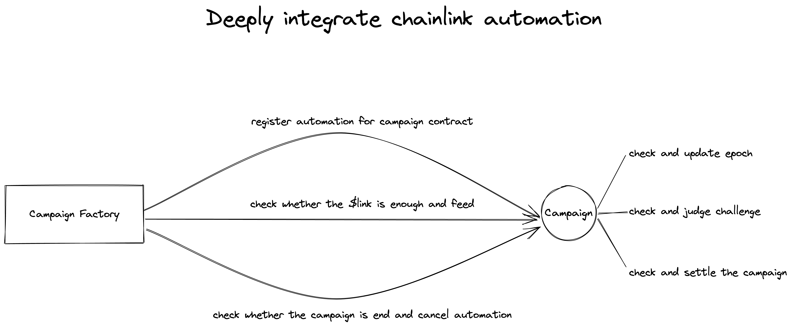
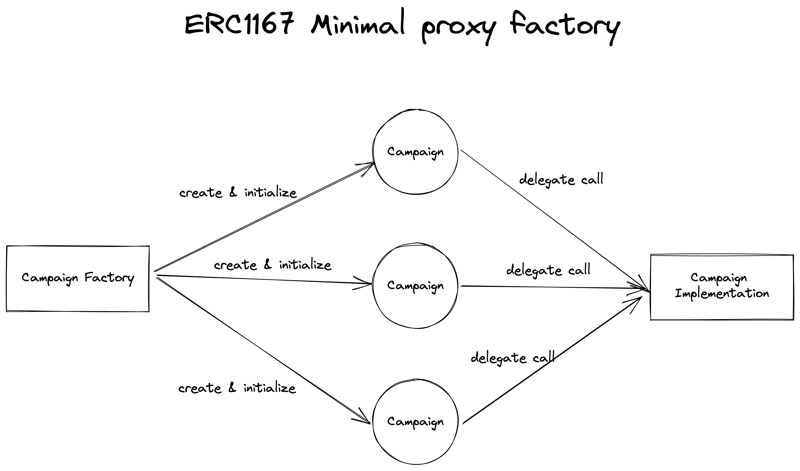

# Sisyphus Protocol

Sisyphus Protocol is a Web3 protocol to help self-improvement and encourage creators economy. Members participating in the campaign will be motivated by the potential rewards of a shared pool of staked tokens.

It was like a habit tracker in Web3, but it differs because of it's blockchain traits as well as its wonderful tokenomics.

## New Feature during Chainlink fall hackathon

- Integrate with Chainlink Automation

- ERC1167 minimal Proxy

- Dynamic NFT with on-chain svg render

- Challenge and vote implementation in contracts and frontend.

- New designed UI

# Demo

Visit our demo video at [Youtube](https://www.youtube.com/watch?v=d_WUjYIAMUg)

## Try the demo

Test environment url: <https://app.tracker3.io>

Require:

- Metamask browser extensions or metamask mobile app
- Matic on mumbai for gas fee. (Get it from public faucet)
- Enough Test **TSS** (ERC20): [0xa3f2ba60353b9af0a3524ee4a7c206d4335a9784](https://mumbai.polygonscan.com/token/0xa3f2ba60353b9af0a3524ee4a7c206d4335a9784) (Mint it at <https://mumbai.polygonscan.com/token/0xa3f2ba60353b9af0a3524ee4a7c206d4335a9784#writeContract>)

# Source Code

Technology used: Solidity, Typescript, Hardhat, Openzepplin, React, wagmi, IPFS, Chainlink, Quick Node, Tenderly.

Source codes are listed below. All copyright reserved.

- FrontEnd: <https://github.com/sisyphusprotocol/tracker3-fe>
- Contract: <https://github.com/sisyphusprotocol/contracts>
- Subgraph: <https://github.com/sisyphusprotocol/sisyphus-v1-subgraph>
